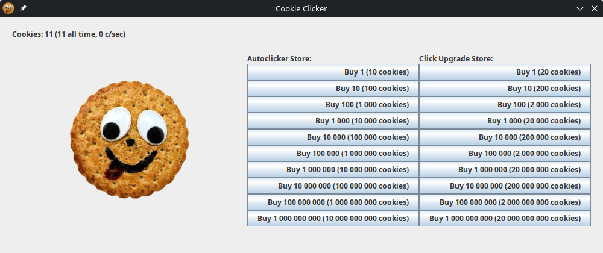

# Cookie Clicker

Cookie Clicker-like game originally made as a final project assignment for an OOP course at university. It uses an MVC architecture and a great deal of design patterns and language features in a way some may consider to be forced.

## Features
- Click the cookie!
- Buy autoclickers to click automatically!
- Buy click upgrades to get more cookies for each click!
- Game will automatically save progress!
- When coming back, it will simulate the amount of cookies you will have gotten while you were gone!

## Adjustments
Changes from the final revision that was handed in:

- The package namespace was changed to `se.voxelmanip.cookie`
- `@author` tags in JavaDocs were changed 
- The Maven build system was replaced with a simple Bash script, as it relied too much on the monorepo we used for all assignments in the course and I didn't feel like messing with Maven build files
